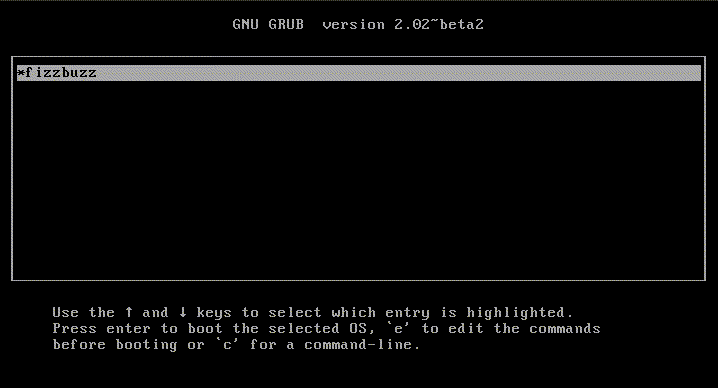

FizzBuzz Freestanding Edition
==============================

[FizzBuzz](https://en.wikipedia.org/wiki/Fizz_buzz) is a common interview question for computer programmers. Creating a list of the first 100 Fizz buzz numbers is a trivial problem for any would-be computer programmer, so interviewers can easily sort out those with insufficient programming ability. -- Wikipedia.

[Freestanding](http://wiki.osdev.org/C_Library#Freestanding_and_Hosted) is a C compilation environment where only a few headers are usable that contains only defines and types. Usually program is compiled in hosted environment, which is meant for user-space programming while freestanding is meant for kernel programming.

Freestanding program runs without operating system, therefore it can not do system call. Actually, the program itself is the only running program in the machine.

We believe simplicity is important in software engineering. So we wanted FizzBuzz to be as lean as possible.

[The popular FizzBuzz implementation](https://github.com/EnterpriseQualityCoding/FizzBuzzEnterpriseEdition) has too many abstractions. Sometimes we don't need all that complexity to just print Fizz and Buzz. **We don't even need an Operating System to do that**.

## Download

The latest release of FizzBuzz Freestanding Edition can be downloaded at the central repository (we don't have mirror yet):
[https://github.com/andylibrian/fizzbuzz-freestanding-edition/releases](https://github.com/andylibrian/fizzbuzz-freestanding-edition/releases)

1. Download the iso file
2. Please verify the integrity of downloaded image, md5sum: `f46f57698cd424fee5c888549df2ff60`
3. Double check the integrity for security, sha512: `f6de1fbc900e620952700415bbbe99b6e0620b986f016eacc64de23c50594859826cebc1116656e8a565f0e9034d027b3593e683dacefa1143841176c99c2418`

## Recommended Minimum System Requirement

To run FizzBuzz Freestanding Edition on a real machine, it should have at least the spec below:

1. CPU i386 architecture
2. 4Mib RAM
3. 12Mib of USB stick or a CD

## Running on Virtual Machine

The iso can run on Virtual Machine such as VirtualBox or Qemu.

## Running on Real Machine

- Burn the ISO to a CD, then boot a PC using it.
- Write the ISO to a USB stick, then boot a PC using it.

## Credits

- boot loader and vga driver are derived from [http://wiki.osdev.org/Bare_Bones](http://wiki.osdev.org/Bare_Bones)
- `itoa` implementation by Lukás Chmela

## Reporting Security Issue

Please send the security issue to me privately if you find one.
Non security issue can be reported on github.

## FAQ

Q: Is this version ready for production?

A: No man, this is just a joke. The iso file is really bootable. Try that on Virtual Box.
